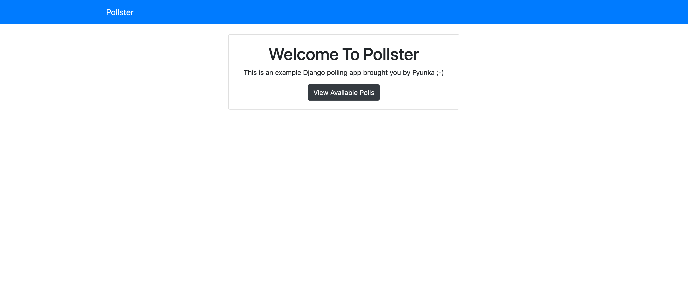
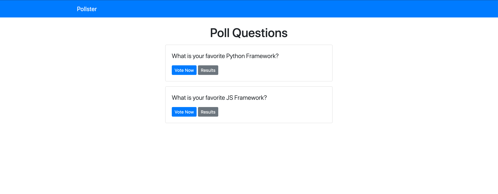

# Pollster App (Django polling app)

> Python Django app to create polls with questions/choices

[](https://opensource.org/licenses/MIT) [](https://GitHub.com/Naereen/StrapDown.js/graphs/contributors/) [](https://github.com/ellerbrock/open-source-badges/) [](https://saythanks.io/to/kennethreitz)

[](https://www.python.org/)




## Quick Start

``` bash
# Install dependencies
pipenv install

cd pollster

# Serve on localhost:8000
python manage.py runserver
```

### Commands Gist
You can find all of the commands from the project here:
https://gist.github.com/fyunka/4e77647608466912d6c41753030267d0
<script src="https://gist.github.com/fyunka/4e77647608466912d6c41753030267d0.js"></script>